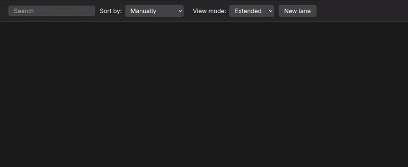

#  Tasks.md
A self-hosted, Markdown file based task management board.




## ⭐ Features
- Create cards, lanes and tags in a modern and responsive interface;
- Write cards as Markdown files;
- Easy to install with a single Docker image;
- Light and dark themes synced with operating system settings;
- Heavily customizable with 3 default color themes ([Adwaita](https://gnome.pages.gitlab.gnome.org/libadwaita/doc/main/named-colors.html), [Nord](https://www.nordtheme.com/) and [Catppuccin](https://github.com/catppuccin/catppuccin));
- Support for subpath based reverse-proxy with an environment variable for base path;
- Can be installed as PWA.

## 🐋 Installation
### Docker
Paste this command:
```
docker run -d \
  --name tasks.md \
  -e PUID=1000 \
  -e PGID=1000 \
  -e TITLE="" \
  -e BASE_PATH="" \
  -e LOCAL_IMAGES_CLEANUP_INTERVAL=1440 \
  -p 8080:8080 \
  -v /path/to/tasks/:/tasks/ \
  -v /path/to/config/:/config/ \
  --restart unless-stopped \
  baldissaramatheus/tasks.md
```
Remove the environment variables you don't want to keep (all of them are optional, PUID and PGID are recommended), replace `/path/to/something` with directories that exist in your filesystem and then execute it. The environment variables are the following:
- `PUID` and `PGID`: User ID and group ID that owns the files and directories. On linux distros you can find your user's UID and GID running `id` in the terminal, but it's usually `1000` for both variables. If no value is assigned for those variables, docker will create all the files and directories as root. You can read more about it [here](https://docs.linuxserver.io/general/understanding-puid-and-pgid/).
- `TITLE`: A given name that shows below the header and in the browser tab;
- `BASE_PATH`: Base path in the url. Use this variable if you are going to run the app under a subpath based reverse-proxy;
- `LOCAL_IMAGES_CLEANUP_INTERVAL`: After a given interval the app will remove all local images that aren't present in any task. This variable control the duration in minutes of this interval. The default value is 1440 (exactly 24h). Set it as 0 to disable it.


### docker-compose
```
version: "3"
services:
  tasks.md:
    image: baldissaramatheus/tasks.md
    container_name: tasks.md
    environment:
      - PUID=1000
      - PGID=1000
    volumes:
      - /path/to/tasks:/tasks
      - /path/to/config:/config
    restart: unless-stopped
    ports:
      - 8080:8080
```
Use the Docker section above as reference for setting up variables and volumes.


### Source code
Open a terminal instance in the frontend directory and another one in the backend directory, then in both of them run `npm install` and `npm start`.

## 🎨 Customize
All CSS files are available in the stylesheets directory under the config volume, any custom style is recommended to be added to `custom.css` file. It already comes with 3 color themes: [Adwaita](https://gnome.pages.gitlab.gnome.org/libadwaita/doc/main/named-colors.html), [Nord](https://www.nordtheme.com/) and [Catppuccin](https://github.com/catppuccin/catppuccin). To use them, change the first line of `/stylesheets/custom.css` to the path of the color theme you want, you can find them under `/stylesheets/color-themes`.

## 📁 Files structure
The way directories and files are organized in Tasks.md is quite simple. Every lane you add within the app is a directory in your filesystem and every task is file.

#### So if your tasks look like this:


#### Your files should look like this:


More details (and it how it looks within Obsidian) can be found [here](https://github.com/BaldissaraMatheus/Tasks.md/issues/49).

## 💻 Technology stack
With the goal of having a good mix of performance and maintainability, the application was built with [SolidJS](https://github.com/solidjs/solid) and [Koa](https://github.com/koajs/koa). It also uses [Stacks-Editor](https://github.com/StackExchange/Stacks-Editor) for text editing and [serve-static](https://github.com/expressjs/serve-static) to serve the css files as-is.

## 🔨 Contribute
### Bugfixes and new features requests
Feel free to create issues for encountered bugs or to request new features, just make sure to include a proper label. Also give a thumbs up to the issues you feel that are relevant to be implemented for the next releases.

### Development
If you want to contribute to its development, select one of the [existing issues](https://github.com/BaldissaraMatheus/Tasks.md/issues), develop your solution and submit a pull request, it will eventually be reviewed and may be merged with the existing code. If you're not confident about your solution, discuss your ideas in a related issue or publish a draft pull request.

